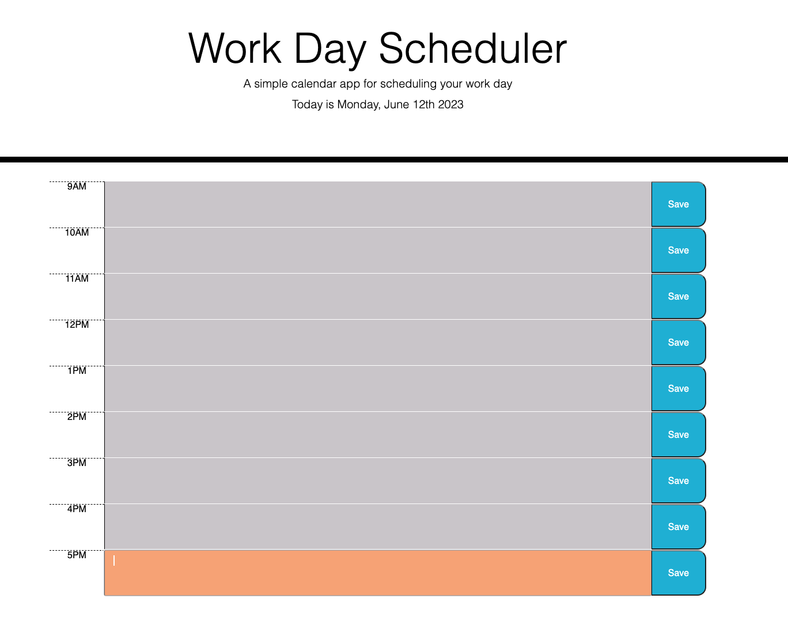

# workday-scheduler
## UCB Bootcamp Module 5 Homework Challenge
This is my submission for our Module 5 Homework Challenge. This application presents a page with timeblocks of standard business hours that include text areas for the user to input their events for each hour block. A javascript function is used to color the timeblocks relative to the current time of day: past, present, or future. Users can save their entered events to local storage, then refresh the page to see their events persist.

## Deployed Page
https://jmariemo.github.io/workday-scheduler/

## Screenshot of page

